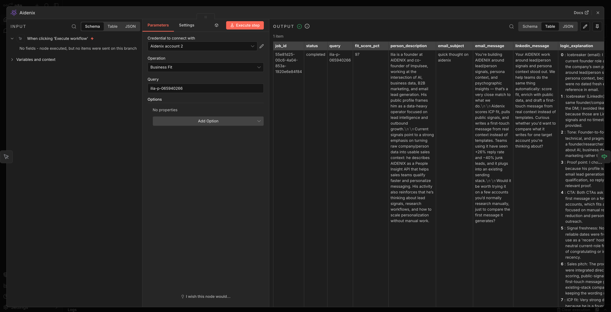
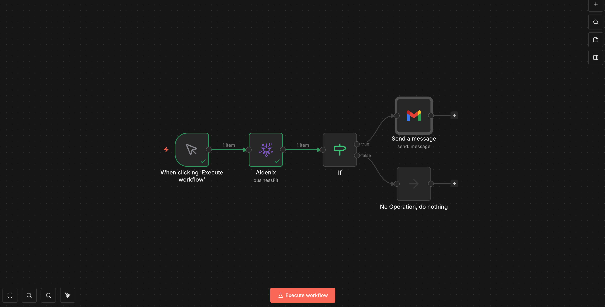

# n8n-nodes-aidenix

[](https://www.npmjs.com/package/n8n-nodes-aidenix)
[](https://www.npmjs.com/package/n8n-nodes-aidenix)
[](./LICENSE.md)

An [n8n](https://n8n.io) community node for [Aidenix](https://aidenix.com) — score each lead against your ICP and write a personalized first email and LinkedIn message, in your brand's voice, from real research, in a single workflow step.

Drop in a LinkedIn slug or an email address. Aidenix researches the person across many data sources, scores fit against your ICP, and writes a first message that sounds like you wrote it for that one person — not a template with a name swapped in.



---

## Table of contents

- [Why Aidenix](#why-aidenix)
- [Features](#features)
- [Prerequisites](#prerequisites)
- [Installation](#installation)
- [Credentials](#credentials)
- [Quick start](#quick-start)
- [Operations](#operations)
- [Response schema](#response-schema)
- [Common workflow patterns](#common-workflow-patterns)
- [Error handling](#error-handling)
- [Idempotency & retries](#idempotency--retries)
- [Troubleshooting](#troubleshooting)
- [Compatibility](#compatibility)
- [Resources & support](#resources--support)
- [License](#license)

---

## Why Aidenix

Real personalization is the hard part of outbound, and a single merge tag doesn't deliver it. A name and a title dropped into a template reads as mass-produced, and prospects ignore it.

Aidenix does the whole job in one node: it researches each lead across many data sources, scores fit against your ICP, and writes the first message in your brand's voice — composed from your own positioning and the lead's real context, not a snippet pasted into a template. You keep your sending tool and your strategy; Aidenix produces the message.

- **Input**: `jane@acme.com` or `jane-doe-12345`
- **Output**: fit score, person/company context, subject line, email body, LinkedIn DM, plus reasoning and Do/Don't guidance

Open and licensed sources only — no traded PII, safe under GDPR and CCPA.

Use it when you want genuinely personal first touches at scale, without building the research-and-writing pipeline yourself.

## Features

- **Business Fit** — pass a LinkedIn slug or email; get an ICP fit score (0–100), a researched person summary, and a ready-to-send email + LinkedIn message written in your brand's voice.
- **Email Intel** — check an address before you spend an analysis on it: does the mailbox accept mail, and is the person still there.
- **Person Signals** — the career moment behind the lead: months in the seat, what they publish themselves, when to reach them. Works even when the address is dead.
- **Company Signals** — the account moment: hiring velocity from career dates, funding and product signals, and a growth / reorg / stealth / stable verdict with the timing.
- **Lists** — assess addresses in bulk, score a whole batch of contacts, poll its status, and read the results page by page.
- **Account & ICP** — quota and plan, the saved ICP profiles, building a profile from a website, and recording an opt-out.
- **Built-in idempotency** — deterministic `Idempotency-Key` per item, so retried executions reuse the cached server response instead of paying for a duplicate AI run.
- **Automatic retry** on `409 in_progress` (still computing) and `504 timeout`, with configurable backoff.
- **Standard n8n error handling** via `NodeApiError`, with full **Continue On Fail** support.
- **HTTPS-only by default**, with a runtime warning if a non-loopback Base URL is configured over plain HTTP.

## Prerequisites

- An n8n instance (Cloud or self-hosted), **n8n v1.0+ recommended**.
- An Aidenix account and an API token — see [Getting an API token](#getting-an-api-token).
- For self-hosted n8n: Node.js **18.10+** (this matches n8n's own engine requirement).

## Installation

### n8n Cloud / self-hosted UI

1. Open **Settings → Community Nodes**.
2. Click **Install a community node**.
3. Enter the package name:
   ```
   n8n-nodes-aidenix
   ```
4. Accept the risk prompt and click **Install**.

The Aidenix node appears in the node picker as **Aidenix**.

### Manual install (self-hosted, advanced)

```bash
cd ~/.n8n/custom   # create if missing
npm install n8n-nodes-aidenix
# restart n8n
```

## Credentials

### Getting an API token

1. Sign up or log in at [aidenix.com](https://aidenix.com).
2. Open your **Profile → API Tokens**.
3. Click **Generate token**, copy the value (it's shown only once — store it somewhere safe).
4. In n8n, create a new **Aidenix API** credential and paste the token into the **API Token** field.

### Credential fields

| Field      | Required | Default                  | Description                                                                                   |
| ---------- | -------- | ------------------------ | --------------------------------------------------------------------------------------------- |
| API Token  | Yes      | —                        | Token issued in the Aidenix dashboard. Stored encrypted by n8n; sent as `X-API-Token` header. |
| Base URL   | No       | `https://api.aidenix.com` | Override only for dedicated tenants or self-hosted Aidenix.                                   |

> **Security note:** the node refuses to log the token and warns if Base URL is plain HTTP to a non-loopback host. Keep Base URL on `https://` in all real environments.

## Quick start

A minimal "score-and-send" workflow:

1. Add a **Schedule Trigger** (or any trigger producing leads).
2. Add a **Google Sheets / Airtable** node to read a list of leads — each row should have an `email` (or `linkedin_slug`) column.
3. Add the **Aidenix** node:
   - **Operation**: `Business Fit`
   - **Query**: `={{ $json.email }}`
   - Leave **Options** at their defaults.
4. Add an **IF** node:
   - Condition: `={{ $json.fit_score_pct }}` ≥ `70`
5. On the `true` branch, add **Gmail / Outlook** with:
   - Subject: `={{ $json.email_subject }}`
   - Body: `={{ $json.email_message }}`

That's the whole pipeline. Idempotency is on by default — re-running a *failed execution* reuses the cached Aidenix response instead of paying for it twice. Running the workflow again on the same lead in a new execution is a fresh computation.

## Operations

### Business Fit

Evaluates ICP fit for a contact and generates personalized outreach.

| Parameter | Type   | Required | Description                                                                  |
| --------- | ------ | -------- | ---------------------------------------------------------------------------- |
| Query     | string | Yes      | LinkedIn slug (`jane-doe-12345`) **or** email (`jane@acme.com`). Auto-detected. |

#### Options

| Option                   | Default        | Description                                                                                                                                |
| ------------------------ | -------------- | ------------------------------------------------------------------------------------------------------------------------------------------ |
| Idempotency Key Strategy | Deterministic  | `Deterministic` — UUID v5 from `workflowId + executionId + itemIndex + query`. Replays reuse the cached response. `Random` — new UUID v4 per item. `Custom` — supply your own. |
| Idempotency Key          | —              | Only used when strategy is `Custom`. Useful when the key comes from an upstream node, e.g. `={{ $json.idempotency_key }}`.                  |
| Max Retries (409 / 504)  | 10             | Retries when the API responds with `409 in_progress` or `504 timeout`.                                                                     |
| Retry Delay (Ms)         | 5000           | Delay between retries.                                                                                                                     |

The retry options apply to every operation. The idempotency options apply to Business Fit only — every other operation either reads (a repeat is safe by nature) or is idempotent on the server side.

### Email Intel

Is the address worth contacting at all. Two independent questions — does the mailbox accept mail, and is the person still there — because a live mailbox at a stale address bounces the deal, not the message. Run it before Business Fit to avoid personalizing for someone who left.

| Parameter      | Type    | Required | Description                                                                                     |
| -------------- | ------- | -------- | ----------------------------------------------------------------------------------------------- |
| Email          | string  | Yes      | The address to assess.                                                                          |
| Deliverability | boolean | No       | Add the SMTP layer. Slow, and blind on catch-all domains, where the person layer decides instead. |
| Enrich         | boolean | No       | Add the dossier: address age, breach exposure, domain reputation, footprint, company card. Slow.  |

Branch on `verdict` (`current-likely`, `former-person-moved`, `former-flagged-historic`, `domain-rebrand`, `personal-mailbox`, `ambiguous-generic-alias`, `unknown-not-in-data`, `uncertain`) or, more simply, on `recommendation.action` (`send`, `caution`, `verify`, `skip`).

### Person Signals

Who the person is and what is going on with them: role and grade, the career trajectory from dates, what they publish themselves, whose content they read, and a verdict with the career moment and how to approach it. It works even when the address is dead, because the person is resolved to their current employer.

| Parameter | Type   | Required | Description                                                              |
| --------- | ------ | -------- | ------------------------------------------------------------------------ |
| Person    | string | Yes      | Email, LinkedIn profile URL, or slug.                                    |

Asked by email, the response carries no `name` and no `slug` — turning a mailbox into an identity is exactly what this API refuses to do, and `identifiers_withheld` says so. Ask by profile URL or slug and the name comes back, since you already hold it. When `match_confidence` is `low`, check `linked_profiles`: above one, several people stand behind that address and the most corroborated was taken.

### Company Signals

The account moment behind the lead: firmographics and revenue, team makeup, hiring velocity from career dates (which catches layoffs a static card misses), activity signals, geo footprint, and a `growth` / `reorg` / `stealth` / `stable` verdict with the outreach timing. Employee names are never returned — only business signals. One call per account covers every lead from it.

| Parameter     | Type    | Required | Description                                                                                       |
| ------------- | ------- | -------- | --------------------------------------------------------------------------------------------------- |
| Company       | string  | Yes      | Domain (resolved exactly) or company name (resolved heuristically).                               |
| Relationships | boolean | No       | Expand the attention teaser into the full map: orgs the team follows, accounts influencing the buyer, internal amplifiers by role. |
| Enrich        | boolean | No       | Add the model read of that map. Needs Relationships on; adds around 20 seconds.                   |

### Email Intel (Bulk)

The same address check across a whole list in one call, so a list can be triaged before any analysis is spent on it. The slow layers apply per address, so a long list with Deliverability or Enrich on takes minutes.

| Parameter      | Type    | Required | Description                                                     |
| -------------- | ------- | -------- | --------------------------------------------------------------- |
| Emails         | string  | Yes      | Addresses separated by commas or newlines. Up to 1000 per call. |
| Deliverability | boolean | No       | Add the SMTP layer to every address.                            |
| Enrich         | boolean | No       | Add the dossier to every address.                               |

### Score a List

Submits a batch of contacts and returns a batch ID. Contacts analysed earlier come from cache and cost nothing new; duplicates inside the list are dropped before anything is spent.

| Parameter  | Type   | Required | Description                                                        |
| ---------- | ------ | -------- | ------------------------------------------------------------------ |
| Contacts   | string | Yes      | Contacts separated by commas or newlines. Up to 10000 per batch.   |
| Batch Name | string | No       | A name so the batch is findable later.                             |

### Batch Status

How far along a batch is: done, pending, failed, served from cache, and how many scored 60 or above — the list worth exporting. Poll this rather than the results page.

| Parameter | Type   | Required | Description                             |
| --------- | ------ | -------- | --------------------------------------- |
| Batch ID  | string | Yes      | The ID returned by **Score a List**.    |

### Batch Results

The analyses themselves, one page at a time. Feed `next_cursor` from the previous page back into Cursor; an empty cursor means you are at the end.

| Parameter | Type   | Required | Description                                     |
| --------- | ------ | -------- | ----------------------------------------------- |
| Batch ID  | string | Yes      | The ID returned by **Score a List**.            |
| Limit     | number | No       | Results per page.                               |
| Cursor    | string | No       | `next_cursor` of the previous page.             |

### Account Context

Plan, quota used and left, when the period resets, and which ICP profile scores are currently weighted against. Worth checking before a large batch.

### ICP Profiles

Every saved profile with its ID, and which one is active.

### Build ICP Profile

Reads a website and saves it as an ICP profile. **The new profile becomes the active one**, so every later score is weighted by it — put this at the start of a workflow deliberately, not in a loop.

| Parameter   | Type   | Required | Description                        |
| ----------- | ------ | -------- | ---------------------------------- |
| Website URL | string | Yes      | The site to read.                  |

### Record Opt-Out

Records that a contact asked to be left alone. An email, a phone number, or a LinkedIn URL — recognised and stored in normalised form. Recording the same contact twice does not create a second record.

| Parameter | Type   | Required | Description                                    |
| --------- | ------ | -------- | ---------------------------------------------- |
| Contact   | string | Yes      | Email, phone number, or LinkedIn URL.          |

## Response schema

The node returns a flat JSON object per input item:

```json
{
  "job_id": "9f1c…",
  "status": "completed",
  "query": "jane-doe-12345",
  "fit_score_pct": 82,
  "person_description": "Jane — CTO at a fintech startup, ~50 engineers, recently raised Series B.",
  "email_subject": "Quick question about your payment flow",
  "email_message": "Hi Jane, …",
  "linkedin_message": "Hi Jane, …",
  "logic_explanation": [
    "Role matches ICP (technical decision-maker)",
    "Company at the right stage (post-Series B)"
  ],
  "strategy": "Practical, problem-first approach",
  "strategy_do": ["Mention the specific pain", "Be concrete about ROI"],
  "strategy_dont": ["Don't open with generic claims", "Don't reference unrelated case studies"]
}
```

All fields are safe to reference directly in downstream nodes via `={{ $json.field_name }}`.

## Common workflow patterns

### 1. Trigger → Score → Conditional send



```
Trigger ─▶ Aidenix (Business Fit) ─▶ IF (fit_score_pct ≥ 70) ─▶ Gmail (send)
                                                                  └▶ No-op (skip)
```

Score every lead, send only to those above your threshold, drop the rest. Swap the manual trigger for a Schedule or Webhook in production.

### 2. Webhook → Real-time enrichment for CRM

```
Webhook (CRM "new lead") ─▶ Aidenix ─▶ HTTP Request (PATCH /crm/leads/{{id}})
```

Push fit score and personalized copy back into HubSpot / Pipedrive in seconds.

### 3. LinkedIn slug enrichment from form fills

```
Typeform Trigger ─▶ Aidenix (Query = ={{ $json.linkedin_url | extractSlug }}) ─▶ Slack (#sales)
```

Notify sales the moment a high-fit lead fills out a form.

## Error handling

The node maps Aidenix's HTTP responses into n8n's standard error flow:

| Code | Meaning                              | Node behavior                                                                  |
| ---- | ------------------------------------ | ------------------------------------------------------------------------------ |
| 200  | Success                              | Body returned as-is.                                                           |
| 409  | `in_progress` — still computing      | **Auto-retry** with the same `Idempotency-Key`.                                |
| 504  | Timeout                              | **Auto-retry** with the same `Idempotency-Key`.                                |
| 422  | Body mismatch on a reused key        | Raised as `NodeApiError`.                                                       |
| 451  | Contact opted out / unavailable      | Raised as `NodeApiError`.                                                       |
| 402  | Quota exhausted                      | Raised as `NodeApiError`. Top up in the Aidenix dashboard.                      |
| 401  | Invalid or revoked token             | Raised as `NodeApiError`. Re-issue the token.                                   |

Enable **Continue On Fail** on the node to push errored items into the success branch as `{ error, query, idempotencyKey }` — useful for partial-success batch workflows.

## Idempotency & retries

The Aidenix API uses `Idempotency-Key` to deduplicate expensive AI runs. By default this node generates a deterministic key from `workflowId:executionId:itemIndex:query`, which means:

- **Re-running a failed execution** reuses the previously-computed result for free.
- **Running the same workflow on the same lead in a new execution** generates a *new* key — you'll get a fresh computation. This is usually what you want, since context (your ICP definition) may have changed.

To force a single deterministic key across executions (e.g. "score this lead once per day, regardless of how many times the workflow fires"), switch the strategy to **Custom** and supply your own:

```
={{ $json.email + ':' + $now.format('yyyy-MM-dd') }}
```

## Troubleshooting

**The node returns `409 in_progress` even after all retries.**
Increase **Max Retries** or **Retry Delay** in the node options. Large batches can occasionally exceed the default 10×5s window during peak load.

**`402 quota_exhausted`.**
Your plan has run out of credits — top up in the Aidenix dashboard. The node will surface this immediately rather than silently degrading.

**`401 unauthorized` after rotating the token.**
n8n credentials cache. Re-open the credential in n8n, paste the new token, save.

**The score looks wrong / outreach feels generic.**
Open a ticket at [aidenix.com](https://aidenix.com) — fit scoring is tied to your account's ICP definition, which is configured outside n8n.

**Base URL warning in execution logs.**
You've set Base URL to a non-loopback `http://` host. Switch to `https://` — the warning means the API token is being sent in cleartext.

## Compatibility

- **n8n**: tested on 1.x. Uses the v1 `INodeType` API.
- **Node.js**: 18.10+ (matches n8n's `engines` requirement).
- **Aidenix API**: this package is maintained alongside the API by the Aidenix team — versions are kept compatible.

## Resources & support

- **Aidenix** — [aidenix.com](https://aidenix.com)
- **API docs** — [aidenix.com/api](https://aidenix.com/api)
- **n8n community nodes guide** — [docs.n8n.io/integrations/community-nodes](https://docs.n8n.io/integrations/community-nodes/)
- **Issues & feature requests** — [GitHub issues](https://github.com/aidenixai/n8n-nodes-aidenix/issues)
- **Email** — [info@aidenix.com](mailto:info@aidenix.com)

## License

[MIT](./LICENSE.md) © Aidenix
